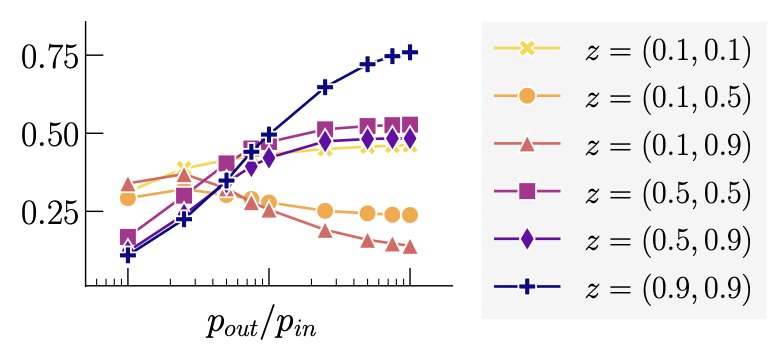
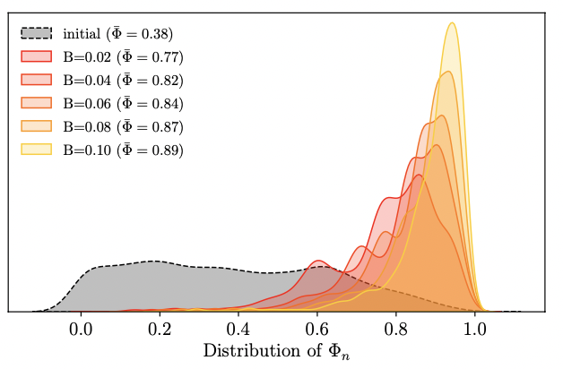

I am a Post-doctoral researcher at the [médialab Sciences Po](https://medialab.sciencespo.fr/en/) in Paris. I work on the [AI-Political Machines](https://medialab.sciencespo.fr/activites/ai-political-machine/) project under the supervision of [Pedro Ramaciotti Morales](https://pedroramaciotti.github.io/).

My research is devoted to the study of opinion dynamics in online social platforms, between theoretical models and empirical observations. I also study the impact of recommender systems, and policies related to the regulation of online social platforms from a practical perspective. Besides that, I have a keen interest in anything related to signed networks.

I am also affiliated with the [Paris Institute of Complex Systems](https://iscpif.fr/?lang=en), and the [Digital Speech Lab](https://www.digitalspeechlab.com/) at University College London.

Previously, I was a PhD student in the Computer Science department of University College London. I was part of the [Centre for Doctoral Training in Cybersecurity](https://www.ucl.ac.uk/computer-science/study/postgraduate-research/centre-doctoral-training-cybersecurity). My research project was supervised by [Benjamin Guedj](https://bguedj.github.io/) and [Shi Zhou](https://wp.cs.ucl.ac.uk/shizhou/).

## Selected publications

### Discord in the voter model for complex networks
A. Vendeville, S. Zhou and B. Guedj. [Phys. Rev. E, 109(2), 024312 (2024)](https://journals.aps.org/pre/abstract/10.1103/PhysRevE.109.024312).

### Opening up echo chambers via optimal content recommendations
A. Vendeville, A. Giovanidis, E. Papanastasiou and B. Guedj. [Proceedings of Complex Networks and Their Applications XI (2023)](https://link.springer.com/chapter/10.1007/978-3-031-21127-0_7).

