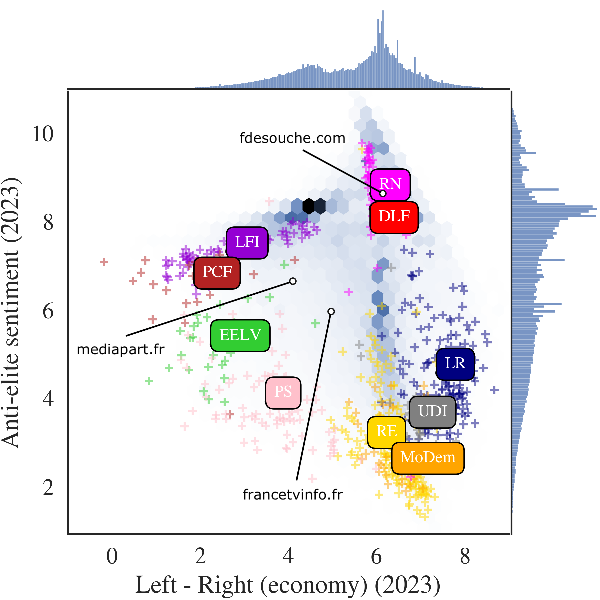
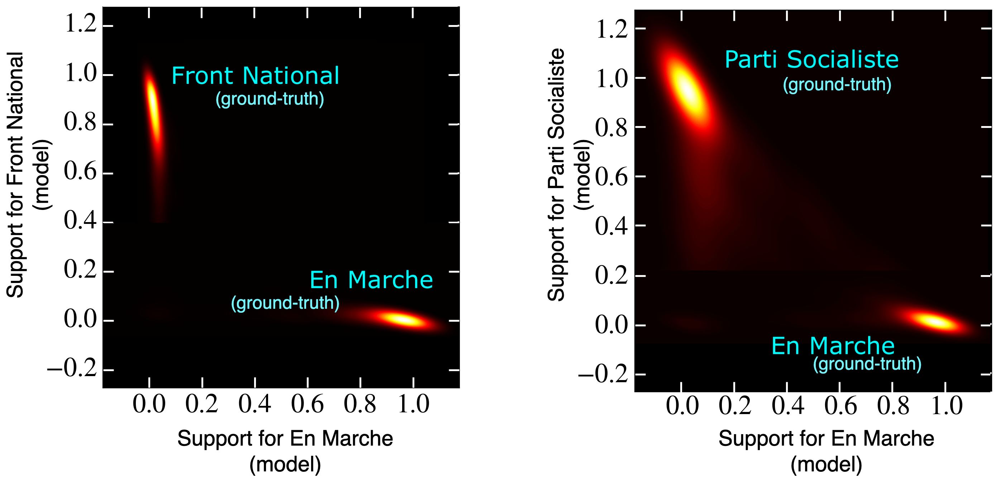

I am a Post-doctoral researcher at the [médialab Sciences Po](https://medialab.sciencespo.fr/en/) in Paris. I work on the [AI-Political Machines](https://medialab.sciencespo.fr/activites/ai-political-machine/) project under the supervision of [Pedro Ramaciotti Morales](https://pedroramaciotti.github.io/).

At the intersection of theoretical models and empirical analyses, my research focuses on the structure of online political and informational landscapes. Recently, I have been working on the public release and the analysis of large X databases, focusing on the multidimensional structure of the users' political opinions. I am also greatly interested in the validation of opinion dynamics models with empirical data, and in the study of signed networks. In general, I strive to conduct research to better understand the impact of social media on our societies.

Previously, I was a PhD student in the Computer Science department of University College London, where I studied the echo chamber effect in social media and proposed methods to mitigate it. I was part of the [Centre for Doctoral Training in Cybersecurity](https://www.ucl.ac.uk/computer-science/study/postgraduate-research/centre-doctoral-training-cybersecurity). My research project was supervised by [Benjamin Guedj](https://bguedj.github.io/) and [Shi Zhou](https://wp.cs.ucl.ac.uk/shizhou/).

I am also affiliated with the [Paris Institute of Complex Systems](https://iscpif.fr/?lang=en) and the [Learning Planet Institute](https://www.learningplanetinstitute.org/en/).

## Data

We just released a public database with measurements of multidimensional political opinions, activity and popularity for almost a million X users, including politicians and media outlets.

[Preprint](https://hal.science/hal-05222448) - [Data](https://osf.io/at5q2/)

## Latest publication

### Voter model can accurately predict individual opinions in online populations

* A. Vendeville. Voter model can accurately predict individual opinions in online populations. [Physical Review E, 111, 064310](https://doi.org/10.1103/PhysRevE.111.064310). Preprint on [arXiv](https://arxiv.org/abs/2501.13215), [HAL](https://hal.science/hal-04849938). Featured in [Physics Magazine](https://physics.aps.org/articles/v18/s76).

In this paper, I show that the Voter Model can predict individual opinions in a large, heterogeneous online population. I study a retweet network collected during the 2017 French presidential elections where accounts of political entities are fixed as reference points. I show that in its equilibrium state, the Voter Model correctly identifies ground-truth opinions of more than 92% of the users.

