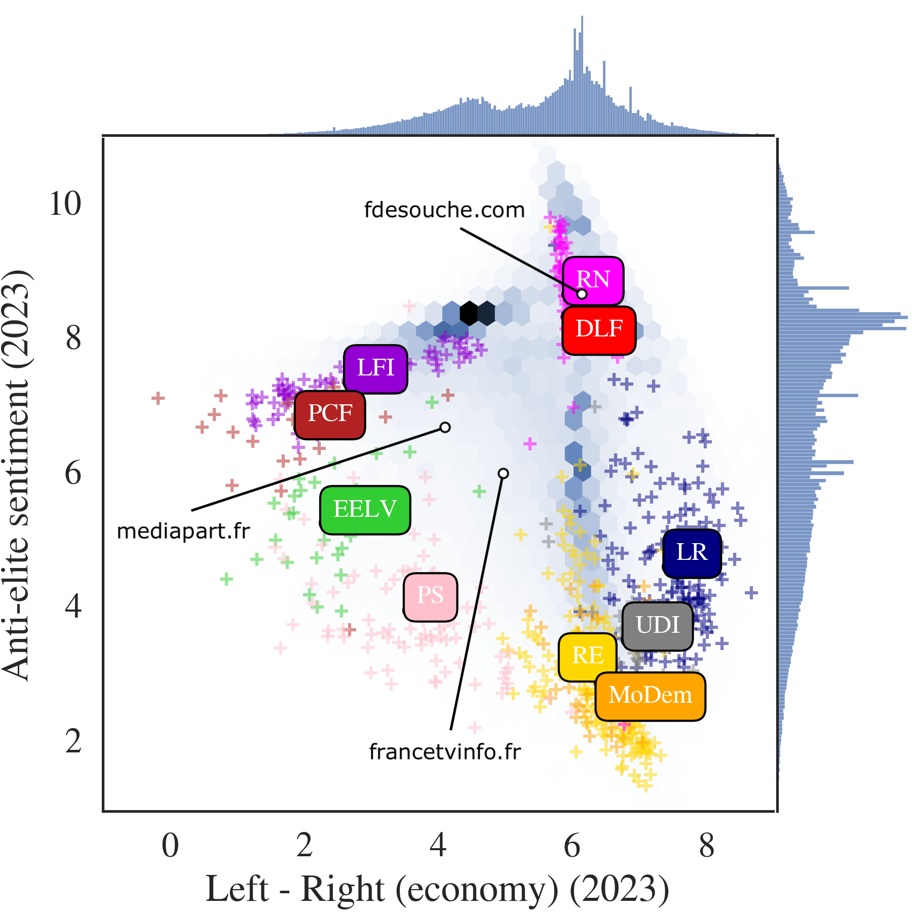
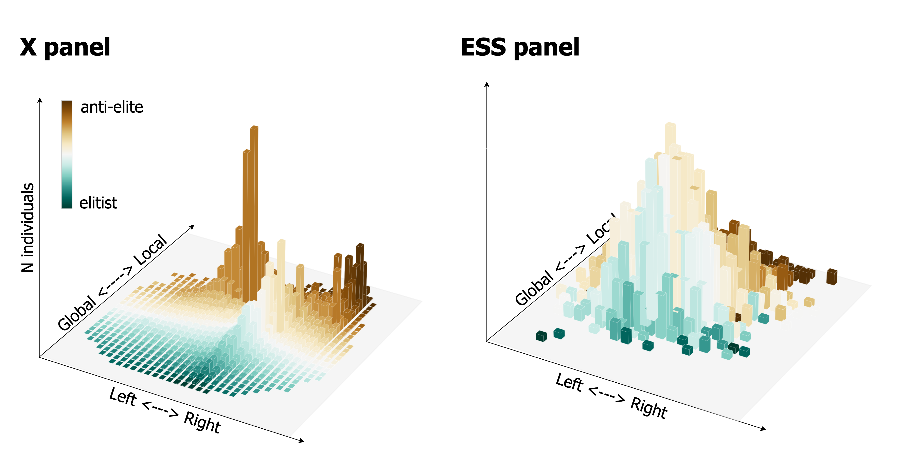

I am a Post-doctoral researcher at the [médialab Sciences Po](https://medialab.sciencespo.fr/en/) in Paris. I work on the [AI-Political Machines](https://medialab.sciencespo.fr/activites/ai-political-machine/) project under the supervision of [Pedro Ramaciotti Morales](https://pedroramaciotti.github.io/).

At the intersection of theoretical models and empirical analyses, my research focuses on the structure of online political and informational landscapes. Recently, I have been working on the public release and the analysis of large X databases, focusing on the multidimensional structure of the users' political opinions. I am also greatly interested in the validation of opinion dynamics models with empirical data, and in the study of signed networks. In general, I strive to conduct research to better understand the impact of social media on our societies.

Previously, I was a PhD student in the Computer Science department of University College London, where I studied the echo chamber effect in social media and proposed methods to mitigate it. I was part of the [Centre for Doctoral Training in Cybersecurity](https://www.ucl.ac.uk/computer-science/study/postgraduate-research/centre-doctoral-training-cybersecurity). My research project was supervised by [Benjamin Guedj](https://bguedj.github.io/) and [Shi Zhou](https://wp.cs.ucl.ac.uk/shizhou/).

I am also affiliated with the [Paris Institute of Complex Systems](https://iscpif.fr/?lang=en) and the [Learning Planet Institute](https://www.learningplanetinstitute.org/en/).

## Data

We just released a public database with measurements of multidimensional political opinions, activity and popularity for almost a million X users, including politicians and media outlets.

[Data in Brief, 112615](https://doi.org/10.1016/j.dib.2026.112615) - [Data](https://osf.io/v28kh/)

## Latest article

### Political attitudes differ but share a common low-dimensional structure across social media and survey data

* with H. Yamashita and P. Ramaciotti. Preprint on [arXiv](https://arxiv.org/abs/2603.02102).

How do political attitudes on social media differ from the general public ?

We compare the structural similarities and differences between political attitudes of almost a million French users of X with those of a nationally representative panel from the European Social Survey, on several political dimensions. 

We foucs on ideological polarization and issue alignment, and evaluate how these are affected by variables of activity, popularity, and exposure. 

Our results highlight two surprising facts. 

1. X users exhibit very different attitudes from the general public on most dimensions, but these attitudes share the same low-dimensional structure, composed of a Left-Right divide (pertaining to issues such as immigration or redistribution of wealth) and a Global-Local divide (pertaining to anti-elitist sentiment and views on EU integration).

2. The most active users exhibit higher levels of polarization and alignment, and increased dissimilarity with the general public. But users who benefit from the most exposure are found to be the most representative of the general public.

This work is a first step towards understanding the multidimensional structure of political opinions across data sources.

