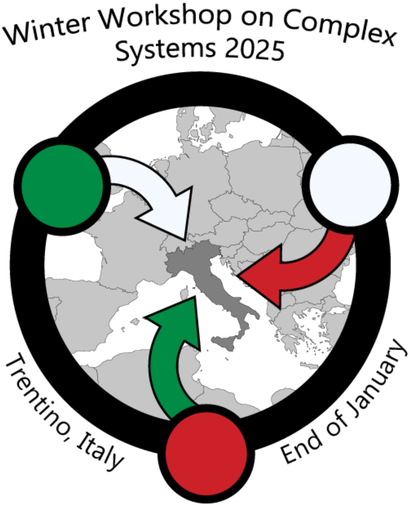
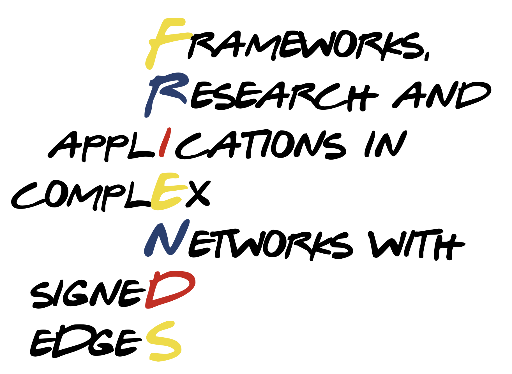

## WWCS2025
I am an organiser of the [Winter Workshop in Complex Systems 2025](https://wwcs2025.github.io/) that will be held in Bergamo at the end of January 2025.

## FRIENDS
I helped organise the [FRIENDS](https://signet-friends.github.io/) satellite in CCS24, that was held in September 2024 in Exeter, UK.

